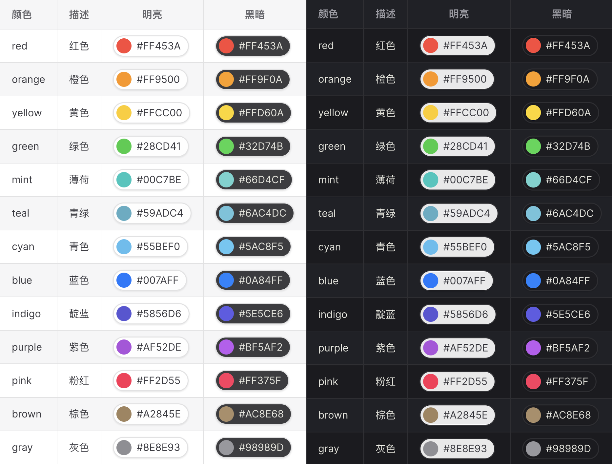

**English** | [**中文**](./README.zh-CN.md)

# Vitepress Color

### Color Preview Plugins for Vitepress

## Features

### Native Theme

The overall appearance of the demo component inherits from the native minimalist style.

### Various Abilities

Supports system following, light mode, dark mode, click copy.



## Installation

### Terminal

```sh
npm i @vitepress-util/color -D
```

### Configure .vitepress/config.mts

```ts
import { defineConfig } from "vitepress";
import { colorVitePlugin } from "@vitepress-util/color";

export default defineConfig({
  // other configs...
  vite: {
    plugins: [colorVitePlugin()],
  },
});
```

## Examples

### Base Format

- ### [#000]
- ### [#000000]
- ### [#00000000]
- ### [rgb(0, 0, 0)]
- ### [rgba(0, 0, 0, 0)]
- ### [hsl(0, 0, 0)]
- ### [hsla(0, 0, 0, 0)]

### with Props

- ### [#000000:light]
- ### [#000000:light-x-thick]
- ### [#000000:light-thick]
- ### [#000000:light-medium]
- ### [#000000:light-thin]
- ### [#000000:light-x-thin]
- ### [#FFFFFF:dark]
- ### [#FFFFFF:dark-x-thick]
- ### [#FFFFFF:dark-thick]
- ### [#FFFFFF:dark-medium]
- ### [#FFFFFF:dark-thin]
- ### [#FFFFFF:dark-x-thin]

## License

### MIT

#### Copyright (c) 2023 - present Crystal Platform
