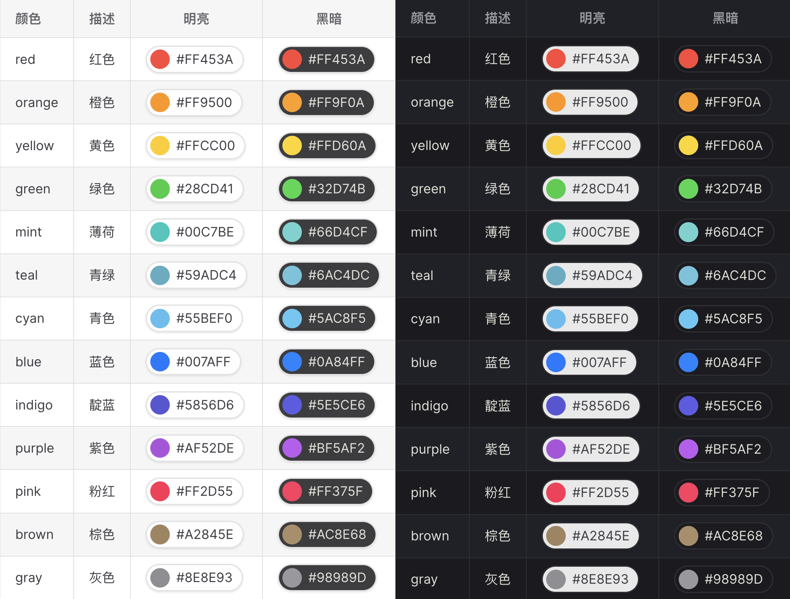

**中文** | [**English**](./README.md)

# Vitepress Color

### 适用于 Vitepress 颜色预览插件

## 特性

### 原生主题

演示组件整体外观继承自原生极简主义风格

### 多种能力

支持跟随系统，明亮模式，黑暗模式，点击复制



## 安装

### 终端 npm

```sh
npm i @vitepress-util/color -D
```

### 配置 .vitepress/config.mts

```ts
import { defineConfig } from "vitepress";
import { colorVitePlugin } from "@vitepress-util/color";

export default defineConfig({
  // 其它配置...
  vite: {
    plugins: [colorVitePlugin()],
  },
});
```

## 用法

### 基本格式

- ### [#000]
- ### [#000000]
- ### [#00000000]
- ### [rgb(0, 0, 0)]
- ### [rgba(0, 0, 0, 0)]
- ### [hsl(0, 0, 0)]
- ### [hsla(0, 0, 0, 0)]

### 附加参数

- ### [#000000:light]
- ### [#FFFFFF:dark]

## 许可

#### MIT

#### Copyright (c) 2023 - present Crystal Platform
